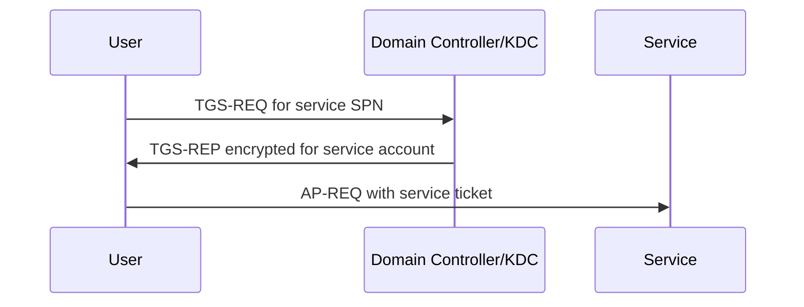

---
title: "Active Directory Kerberoasting: From SPN Enumeration to Offline Cracking"
description: "A defender-focused deep dive into Kerberoasting mechanics, detection opportunities, and hardening recommendations for enterprise Active Directory environments."
author: "Sivabalan Chandra Sekaran"
pubDate: 2025-10-28
coverImage: "images/covers/kerberoasting.svg"
tags: ["active-directory", "kerberos", "offensive-security", "cracking"]
categories: ["Active Directory", "Windows Internals"]
references:
  - title: "MITRE ATT&CK T1558.003: Kerberoasting"
    url: "https://attack.mitre.org/techniques/T1558/003/"
  - title: "Microsoft: Event 4769 - A Kerberos service ticket was requested"
    url: "https://learn.microsoft.com/en-us/windows/security/threat-protection/auditing/event-4769"
  - title: "Microsoft: Group Managed Service Accounts overview"
    url: "https://learn.microsoft.com/en-us/windows-server/identity/ad-ds/manage/group-managed-service-accounts/group-managed-service-accounts/group-managed-service-accounts-overview"
  - title: "Impacket GetUserSPNs.py"
    url: "https://github.com/fortra/impacket"
---

## Introduction

Kerberoasting is a credential access technique against Active Directory service accounts. The attack abuses normal Kerberos behavior: any authenticated domain principal can request a service ticket for a Service Principal Name (SPN), and part of that ticket is encrypted with key material derived from the service account password.

If the service account password is weak, stale, or human-generated, the ticket can be cracked offline without creating account lockouts.

## Why SPNs Matter

SPNs map services to logon accounts. Examples include SQL Server, IIS application pools, backup agents, and custom enterprise services. When a client requests access to an SPN, the Key Distribution Center returns a Ticket Granting Service (TGS) ticket.



That design is normal Kerberos. Kerberoasting becomes possible when an attacker requests many service tickets and takes the encrypted material offline for password guessing.

## Enumeration

Defenders should understand the same enumeration paths attackers use, because they are also useful for exposure review.

```powershell title="enumerate_spns.ps1"
Get-ADUser -LDAPFilter "(servicePrincipalName=*)" -Properties servicePrincipalName,adminCount,pwdLastSet |
  Select-Object SamAccountName, Enabled, adminCount, pwdLastSet, servicePrincipalName
```

Useful risk questions:

- Does the account have privileged group membership?
- Is the password old enough to predate current password policy?
- Is the account configured for RC4 only or missing AES support?
- Is the SPN tied to a business-critical service with broad access?

## Ticket Requests and Cracking

Tools such as Impacket's `GetUserSPNs.py`, Rubeus, and PowerView can request service tickets and format them for offline cracking. In an authorized lab, that may look like this:

```bash title="authorized_lab_example.sh"
impacket-GetUserSPNs -request -dc-ip 10.0.0.10 CORP.LOCAL/auditor
```

The important defensive detail is not the tool name. It is the pattern: a normal user account requests service tickets for service accounts it does not usually access, often in a burst, and especially with RC4 encryption type `0x17`.

## Detection With Event 4769

Windows Security Event ID 4769 is generated when a domain controller receives a Kerberos TGS request. Microsoft documents fields such as `ServiceName`, `TicketEncryptionType`, client address, and ticket metadata.

High-signal Kerberoasting analytics usually combine:

1. Event ID 4769 from domain controllers.
2. `TicketEncryptionType` equal to `0x17` where RC4 should be rare.
3. A single account requesting many distinct service tickets.
4. Requests for privileged or high-value service accounts.
5. Deviation from the user's normal service access baseline.

```yaml title="sigma_kerberoast_tgs_rc4.yml"
title: Possible Kerberoasting Via RC4 TGS Requests
status: test
logsource:
  product: windows
  service: security
detection:
  selection:
    EventID: 4769
    TicketEncryptionType: '0x17'
  filter_machine_accounts:
    ServiceName|endswith: '$'
  condition: selection and not filter_machine_accounts
fields:
  - AccountName
  - ServiceName
  - ClientAddress
  - TicketEncryptionType
falsepositives:
  - Legacy applications requiring RC4
  - Service discovery or administrative inventory jobs
level: medium
```

This rule is intentionally conservative. A production analytic should aggregate by requester, time window, and count of unique `ServiceName` values.

## Real-World Tradecraft

MITRE ATT&CK tracks Kerberoasting as T1558.003 and notes use by intrusion sets and offensive frameworks. In real incidents, Kerberoasting often appears after initial domain access and before lateral movement. A cracked service account can provide:

- Access to databases or application servers.
- Local administrator rights on specific hosts.
- A path to privileged groups through nested permissions.
- Long-lived persistence if the service password rarely rotates.

## Hardening Recommendations

1. Use group Managed Service Accounts where supported so passwords are long, random, and automatically managed.
2. Enable AES Kerberos encryption and reduce RC4 dependency.
3. Rotate service account passwords, especially for legacy human-created accounts.
4. Remove Domain Admin or broad local admin rights from service accounts.
5. Monitor Event ID 4769 patterns from domain controllers.
6. Build an SPN inventory and review it on a schedule.
7. Create honey SPNs only if the monitoring and response process is ready.

## Takeaways

Kerberoasting is not a Kerberos bug. It is an operational weakness created by weak service account passwords, excessive privileges, legacy encryption, and poor visibility into ticket requests.

The best defense is boring in the best way: strong managed service identities, least privilege, AES support, and reliable domain controller telemetry.
