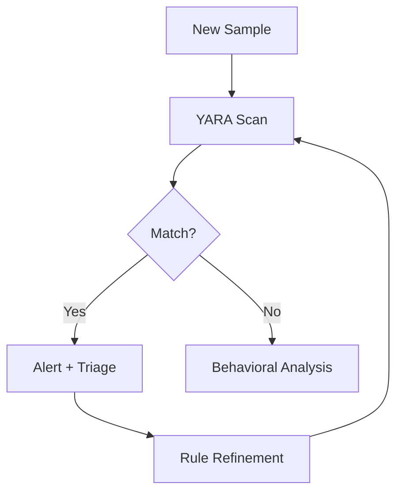

## Why YARA Still Matters

Despite EDR telemetry advances, YARA remains essential for hunting across disk, memory, and log-embedded payloads. Well-crafted rules provide deterministic detection that complements behavioral analytics.

## Rule Structure Best Practices

```yara title="template_rule.yar"
rule Template_MalwareFamily {
    meta:
        description = "Detects MalwareFamily loader"
        author = "Sivabalan Chandra Sekaran"
        date = "2025-07-05"
        hash = "sha256:abc123..."
        severity = "high"
        reference = "internal-ticket-1234"

    strings:
        $mz = { 4D 5A }
        $s1 = "InitializeSecurityContext" ascii wide
        $s2 = { 48 8B 05 ?? ?? ?? ?? 48 85 C0 74 ?? 48 8B 08 }
        $s3 = /https?:\/\/[a-z0-9.-]+\.(com|net|xyz)\// ascii

    condition:
        $mz at 0 and
        filesize < 5MB and
        2 of ($s*)
}
```

## String Selection Guidelines

1. **Prefer byte sequences** over plain strings for obfuscated code paths
2. **Use wildcards sparingly** — each `??` doubles search space
3. **Avoid common API names alone** — combine with unique byte patterns
4. **Include filesize bounds** to reduce scan time and false positives

## Testing Workflow

```bash title="yara_testing.sh"
# Test against clean corpus (expect zero matches)
yara -r rules/malware_family.yar /path/to/clean/binaries/

# Test against malware corpus
yara -r rules/malware_family.yar /path/to/malware/samples/

# Measure performance
time yara -r rules/malware_family.yar /large/corpus/
```

## Memory vs File Rules

| Context | Considerations |
|---------|----------------|
| File scanning | MZ header check, filesize limits |
| Memory scanning | Skip MZ requirement, target injected regions |
| Email gateways | Focus on document macros, archive contents |

```yara title="memory_rule.yar"
rule CobaltStrike_Beacon_Memory {
    meta:
        description = "Detects Cobalt Strike beacon in memory"
        author = "Sivabalan Chandra Sekaran"

    strings:
        $config = { 00 01 00 01 00 02 }
        $pipe = "\\\\.\\pipe\\" ascii

    condition:
        any of them and
        not pe.is_pe  // Memory-only, not a file on disk
}
```

## Operational Deployment

Integrate rules into your detection pipeline:



## Common Pitfalls

- **Overly broad strings** matching legitimate software (e.g., `kernel32.dll`)
- **Missing metadata** making rules untraceable during incidents
- **No version control** for rule changes across the team
- **Skipping false positive testing** against enterprise software baseline

[^1]: VirusTotal YARA allows testing rules against their corpus before deployment.

[^1]: The Yara-Rules community repository provides examples but should never be deployed without local validation.
