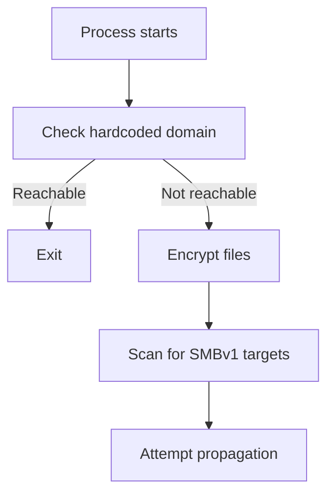

---
title: "WannaCry Ransomware: Static Triage, Kill Switch Logic, and MS17-010 Lessons"
description: "A real-world malware analysis case study of WannaCry, focusing on its SMBv1 propagation, kill switch behavior, and defensive lessons from the 2017 outbreak."
author: "Sivabalan Chandra Sekaran"
pubDate: 2025-11-15
coverImage: "images/covers/reverse-engineering.svg"
tags: ["malware", "reverse-engineering", "wannacry", "ms17-010"]
categories: ["Reverse Engineering", "Malware Analysis", "Incident Response"]
references:
  - title: "Microsoft Security Bulletin MS17-010"
    url: "https://learn.microsoft.com/en-us/security-updates/securitybulletins/2017/ms17-010"
  - title: "Microsoft Security Blog: WannaCrypt ransomware worm targets out-of-date systems"
    url: "https://www.microsoft.com/en-us/security/blog/2017/05/12/wannacrypt-ransomware-worm-targets-out-of-date-systems/"
  - title: "NCSC: Global ransomware campaign"
    url: "https://www.ncsc.gov.uk/news/global-ransomware-campaign"
  - title: "MalwareTech: How to accidentally stop a global cyber attack"
    url: "https://www.malwaretech.com/2017/05/how-to-accidentally-stop-a-global-cyber-attacks.html"
---

## Executive Summary

WannaCry was not notable because its ransomware logic was especially advanced. It was notable because it combined commodity ransomware behavior with worm-like propagation against vulnerable SMBv1 services. Microsoft had released MS17-010 on March 14, 2017, but many systems remained unpatched when the outbreak began on May 12, 2017.

For defenders, WannaCry is a useful case study because it connects reverse engineering, patch management, network segmentation, and incident response in one incident.

## Sample-Level Triage

A safe static triage workflow starts with metadata, imports, strings, and embedded resources. Do this in an isolated malware lab, never on a production workstation.

```bash title="static_triage.sh"
sha256sum sample.bin
file sample.bin
strings -a sample.bin | tee strings.txt
```

Common triage findings for WannaCry-family samples include:

- Windows PE executable format.
- Ransom note resources and language assets.
- References to file encryption behavior.
- Network logic for SMB scanning and propagation.
- A hardcoded domain check that became known as the kill switch.

The exact hash set varies by sample and repackaged variants, so detection should not rely only on one hash.

## Kill Switch Logic

One of the most important discoveries during the outbreak was that the malware checked whether a hardcoded domain could be reached. If the domain resolved and responded, the sample exited before continuing encryption and propagation logic.

In simplified pseudocode, the behavior looked like this:

```c title="kill_switch_pseudocode.c"
if (http_request(KILL_SWITCH_DOMAIN) == SUCCESS) {
    exit_process();
}

start_ransomware();
start_smb_scanner();
```

Registering and sinkholing the domain slowed the original outbreak, but it was not a complete fix. Already infected hosts still needed containment and recovery, and later variants could remove or change this check.



## MS17-010 and SMBv1 Propagation

Microsoft's MS17-010 bulletin described critical vulnerabilities in SMBv1 where specially crafted messages could allow remote code execution. WannaCry operationalized this class of weakness by scanning for reachable SMB services and spreading to unpatched systems.

The defensive takeaway is not simply "patch faster." It is:

1. Remove SMBv1 where it is not required.
2. Prevent workstation-to-workstation SMB exposure.
3. Restrict inbound TCP/445 at network boundaries.
4. Track unsupported operating systems as explicit business risk.
5. Confirm patch coverage with authenticated scanning, not assumptions.

## Reverse Engineering Focus Areas

Analysts working a WannaCry-like sample should focus on:

### Imports and API Use

Look for Windows CryptoAPI, file traversal, service control, networking, and process management APIs.

```text title="import_triage.txt"
CryptAcquireContext
CryptGenKey
FindFirstFile
FindNextFile
CreateFile
WriteFile
InternetOpenUrl
```

### Configuration and Resources

Extract embedded resources for ransom note text, UI artifacts, and operational strings.

```bash title="resource_triage.sh"
objdump -x sample.bin
rabin2 -zz sample.bin
```

### Network Behavior

Replay should happen only in a contained lab with controlled DNS and no route to the public internet. During real response, use logs instead:

- DNS queries for known kill-switch or variant domains.
- TCP/445 scanning patterns.
- New file extensions and ransom note creation.
- Unexpected SMB connections between peer workstations.

## Detection Ideas

```yaml title="sigma_wannacry_style_activity.yml"
title: WannaCry Style SMB Worm And Ransomware Indicators
status: test
logsource:
  product: windows
detection:
  selection_note:
    TargetFilename|contains:
      - '@Please_Read_Me@.txt'
      - 'WanaDecryptor'
  selection_smb:
    DestinationPort: 445
  condition: selection_note or selection_smb
fields:
  - Image
  - CommandLine
  - TargetFilename
  - DestinationIp
falsepositives:
  - File-name based detections can match malware labs or restored evidence
level: high
```

Use this as a starting point, not a production-ready rule. Production logic should include process ancestry, volume of SMB connection attempts, host role, and known-good administrative activity.

## Lessons for Incident Response

1. Patch critical externally reachable and wormable services with emergency priority.
2. Treat SMBv1 as legacy risk and remove it wherever possible.
3. Segment endpoints so one infected workstation cannot freely scan the estate.
4. Keep offline backups and test restore procedures.
5. Preserve malware samples, logs, and memory evidence before wiping hosts.

## Takeaways

WannaCry was a reminder that malware impact often comes from operational conditions, not only code sophistication. A wormable vulnerability, delayed patch adoption, flat networks, and unsupported systems created the blast radius.

Reverse engineering explains how the sample behaved. Asset management and network architecture explain why it spread.
