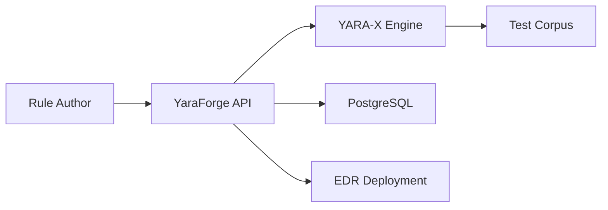

## Overview

YaraForge centralizes YARA rule lifecycle management for security teams drowning in ad-hoc rule files. It provides structured metadata, automated testing against corpora, and deployment pipelines to EDR platforms.

## Features

- **Rule versioning** with Git-backed history and diff views
- **Corpus testing** against clean and malicious sample sets
- **False positive tracking** with analyst feedback loops
- **Deployment API** for CrowdStrike, SentinelOne, and custom scanners
- **Performance metrics** including scan time and match rates

## Architecture

The backend is written in Rust for performance-critical YARA scanning, with a React frontend for rule authoring and review workflows.



## Getting Started

```bash
git clone https://github.com/yourusername/yaraforge
cd yaraforge
cargo run --release
```

See the repository README for full configuration options including corpus paths and deployment credentials.
